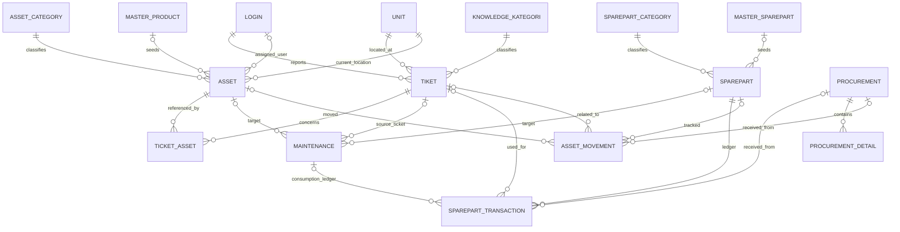

# IT Helpdesk and Inventory Data Model

This document summarizes the PostgreSQL model implemented by backend migrations `006` and `009`-`012`.

## Entity Relationship

## Main Tables

| Table | Purpose | Relationships |
| --- | --- | --- |
| `master_product` | Reusable asset product/SKU defaults and specifications | `asset.id_master_product` |
| `master_sparepart` | Reusable sparepart SKU, unit and minimum stock | `sparepart.id_master_sparepart` |
| `asset` | Individual asset identity, location, status and assignment | Category, master product, room, user |
| `sparepart` | Sparepart catalogue and current balance | Category and master sparepart |
| `tiket` | Helpdesk report, reporter, room, priority and status | `ticket_asset`, maintenance and ledger |
| `ticket_asset` | Many-to-many affected assets for a ticket | Composite key `(id_tiket, id_asset)` |
| `maintenance` | Work record targeting an asset, a sparepart, or both | Optional asset and sparepart, optional ticket |
| `asset_movement` | Asset movement, accountability and receipt history | Optional asset/sparepart, PIC, ticket and PO |
| `sparepart_transaction` | IN/OUT balance ledger with before/after stock | Sparepart, optional ticket/PO, PIC |
| `procurement` / `procurement_detail` | Purchase order and line items | Receipt links to balance ledger |
| `knowledge_article` | Troubleshooting article, tags, level and video | Knowledge category |

## Data Rules

- Master SKU codes are unique. A sparepart stock row may point to one master SKU.
- A ticket can reference multiple assets through `ticket_asset`.
- A maintenance record must target an asset, a sparepart, or both. Sparepart quantity must be a positive integer.
- Maintenance type: `Preventive`, `Corrective`, or `Inspection`. Status: `scheduled`, `in_progress`, `completed`, or `cancelled`.
- Sparepart consumption locks the stock row, checks available quantity, updates the balance and writes `sparepart_transaction` before/after values in the same database transaction as the maintenance record.
- Editing a maintenance record reverses its old sparepart reservation and applies the new quantity atomically. Deleting it writes a compensating stock transaction instead of erasing ledger history.
- Stock adjustments and received PO lines must update balance and ledger atomically. Use the ledger to explain every balance change.

## Ticket-to-Repair Flow

1. A requester creates a ticket and selects one or more affected assets. The API validates each ID, creates the ticket and its `ticket_asset` links in one transaction.
2. A technician records maintenance against an asset, sparepart, or both, and may associate the originating ticket.
3. If a sparepart is selected, the API locks the stock row, rejects insufficient stock, decrements balance, records an OUT transaction and commits the maintenance record and audit event together.
4. Ticket detail shows the affected assets and maintenance entries. Inventory history shows the matching sparepart transaction.
5. Receiving a purchase order increases stock and writes a linked IN transaction or asset movement referencing that PO.

## Migrations

- `backend/migrations/006_create_inventory_tables.js`: inventory, SKU master, movements, transactions and procurement.
- `backend/migrations/009_add_maintenance_ticket_link.js`: optional source ticket on maintenance.
- `backend/migrations/010_link_inventory_tickets_and_masters.js`: SKU foreign keys, ticket/asset link and movement/ledger references.
- `backend/migrations/011_constrain_maintenance_values.js`: maintenance type and status checks.
- `backend/migrations/012_maintenance_asset_sparepart_targets.js`: optional maintenance asset, optional sparepart and quantity constraint.
- `backend/migrations/013_link_sparepart_transactions_to_maintenance.js`: direct maintenance reference from stock ledger rows.